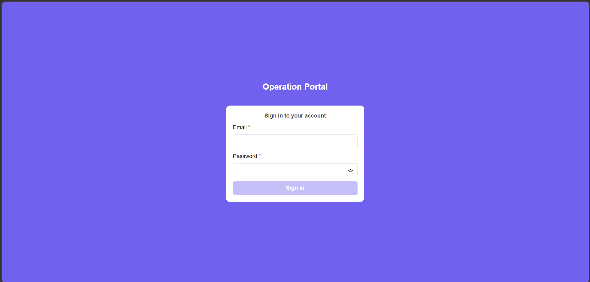
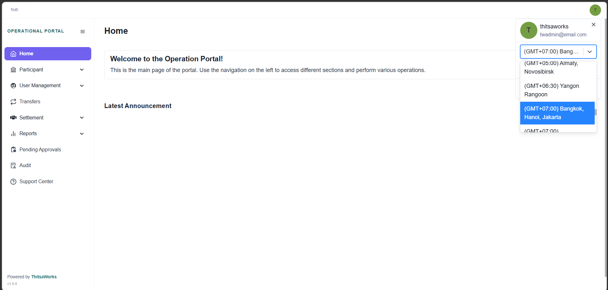
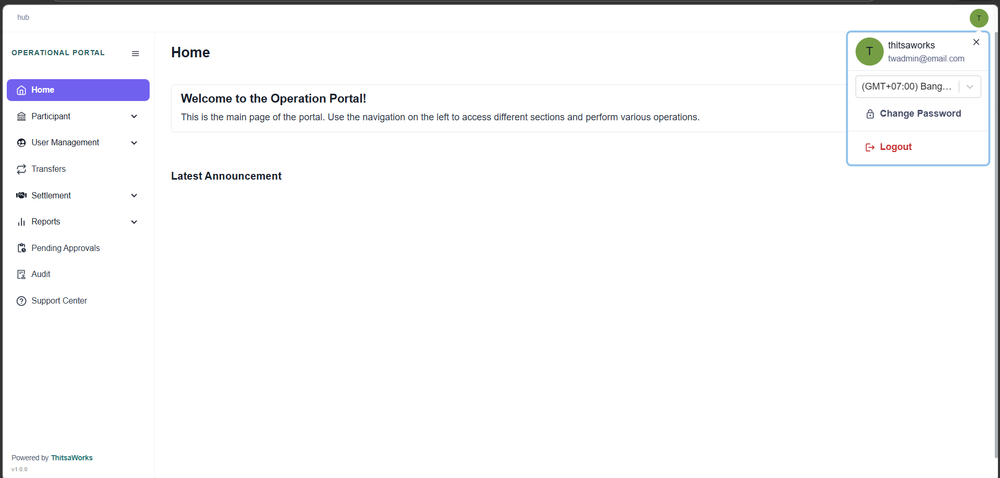

# Introduction

Hello everyone, and welcome to BetterNext!

This course was developed by the Department of Business & Product Operation Office (BPOO) here at ThisaWorks. At ThisaWorks, we are committed to the continuous improvement of our products, ensuring they remain reliable and consistent for all users.

The purpose of this course is to guide you through the transition to Operation Portal, our new platform replacing Finance Portal. Throughout this training, you will discover the key benefits of Operation Portal, including an enhanced user interface, a more intuitive user experience, and a powerful new suite of features.

## Accessing the Platform

To access the Operational Portal, you will need valid login credentials. These are created and assigned to you by an Admin-level user.

## User Profile

After logging in successfully, you will land on the main dashboard. Let's take a look at what you can customize within your User Profile.

## Adjusting Time Zone

By clicking on your User Profile, you will see a dropdown menu. Here, you can adjust the Time Zone setting to match your local region. This ensures all transaction timestamps and system logs are displayed accurately for your location.

## Logging Out

Once you have completed your tasks and are ready to leave the platform, simply click the Logout button to securely end your session.

# Classification

This course is divided into two primary sections: User Types and Their Permissions, and Menus and Their Features.

## User Categories

We will begin by looking at the various user categories and what each role is authorized to do within the system.

Our system defines six distinct roles to ensure security and operational efficiency:

- HUB-Admin
- HUB-Manager
- HUB-Operator
- HUB-User
- DFSP-Admin
- DFSP-Operation

The HUB-Admin holds the highest level of authorization within the platform. This role is granted full administrative privileges, user management, and high-level operational overrides.

## Menus
Next, we will walk through the navigation structure of the platform. There are nine primary menus available, which serve as the foundation for all your tasks in OP.

- Home
- Participant
- User Management
- Transfers
- Settlement
- Reports
- Pending Approvals
- Audit
- Support Center

Understanding these menus is key to mastering the system. We will break them down one by one, explaining the specific features housed within each and how they correlate to your specific user permissions.
