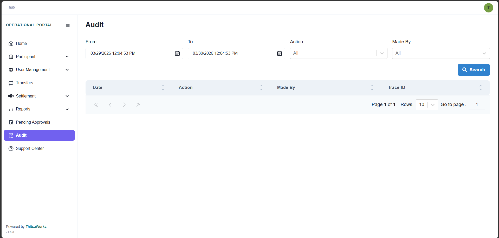
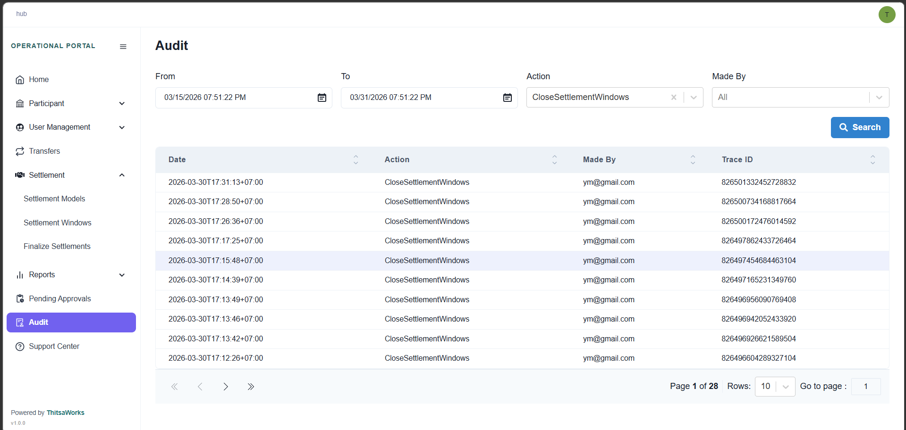

# Menu
## Audit

Let’s take a look at the Audit Page. Think of this as the system's black box—it tracks every action taken in the portal in exact chronological order. It is a vital tool for security oversight and compliance because it answers three key questions: What happened? When did it happen? And who was responsible?

Since this page is built strictly for monitoring and review, it is completely read-only. However, you can use it to deep-dive into the data, allowing you to inspect both the user's request and the system's response for any listed action.

When it comes to locating specific records in the Audit log, the system offers powerful search filters. You can narrow down your search by selecting a specific date range to see exactly when an action occurred.

Additionally, you can filter the log by specific actions or search directly by user to find out exactly who performed a particular task.

