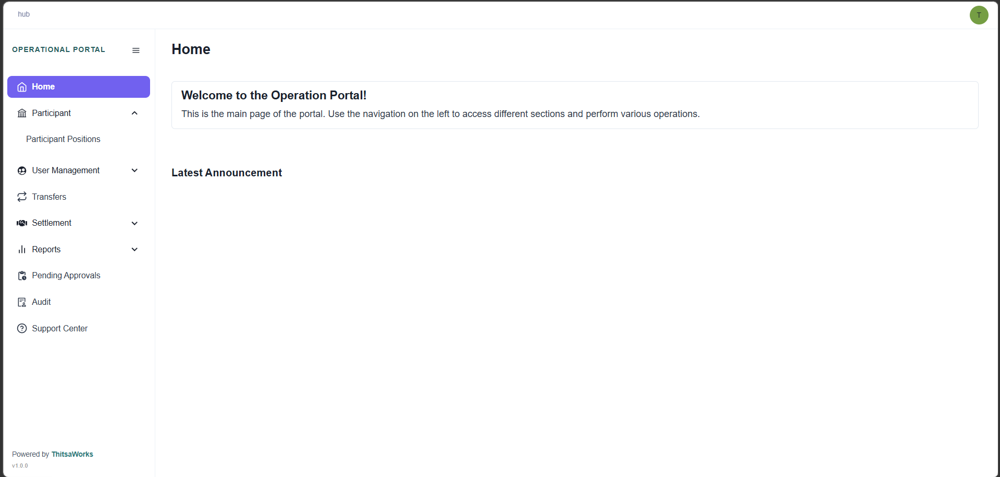
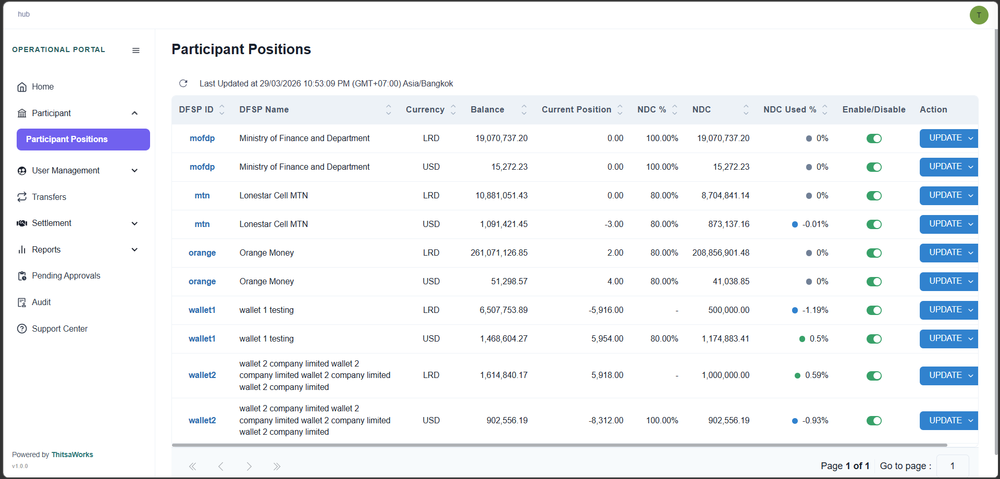

# Menus
## Home

Upon logging in, you will land on the Home Page.
The Home Page serves as your initial welcome screen. This is where you can view the latest company announcements and stay updated on important platform news.

## Participant

Next up is the Participant Menu, where you can monitor the status of all participating entities.

Here, you will find a list of all onboarded DFSPs (Digital Financial Service Providers). This section also allows you to track the real-time operational status of each DFSP based on their recent transaction activity.

Your view in the Participant Menu depends on your credentials. HUB users can view the status of all DFSPs across the system, while DFSP users are restricted to viewing only their own organization's status.

### DFSP ID
DFSP ID is Unique identifier assigned during DFSP onboarding, and is displayed once per currency when the DFSP is onboarded.

### DFSP Name
DFSP name is official DFSP name as configured in the Organization Profile.

### Currency
Currency in which the DFSP participates in the scheme. Each currency maintains a separate liquidity account and NDC.

### Balance
Balance is The current liquidity balance of the DFSP. It represents the available funds in the DFSP’s liquidity account at the settlement bank, and is displayed with up to two decimal places.

### Current Position
Current position is the sum of incoming amounts (positive value) and outgoing amounts (negative value). If it is zero, it means incoming and outgoing transfers are balanced.

### NDC % and NDC
NDC, which stands for Net Debit Cap,  defines the maximum net outgoing position a DFSP is permitted to reach during a settlement window. You can configure NDC in two ways
- Fixed Amount NDC
    - When you configure the NDC as fixed for a DFSP, you can check the amount under the NDC column.
- Percentage-Based NDC
    - When you configure the NDC as percentage-based for a DFSP, you can check the percentage you defined under the NDC % column and how much the amount will be under the NDC column. If the NDC type is percentage-based, the NDC amount will vary based on the balance, also known as liquidity amount.

### NDC Used %
It displays the ratio of the Current Position to the Net Debit Cap (NDC). It indicates how much of the DFSP’s allowed net outgoing exposure is currently being used. The value is presented with color indicators to support quick interpretation.

- If it is black, it means there is no usage or all the positions are balanced.
- If it is blue, it means there is net outgoing usage below 40%.
- If it is red, it means there is net outgoing usage at or above 40%.
- If it is green, it means there is a net incoming position.

### Enable/ Disable
When you log in as an Admin-level or Manager-level user, you can suspend a DFSP’s ability to send 
and receive transfers in order to manage operational or liquidity risk, because there might be
- Suspicious or abnormal transaction behavior
- Liquidity risk scenarios
- Operational issues with the settlement bank

### Action
Under the Action column, you will find the Update button. Clicking this allows you to initiate deposits, process withdrawals, and configure the Net Debit Cap (NDC).

Please note that once you submit any of these actions, the request will automatically route to the Pending Approval page, which we will review in detail later in this course.

