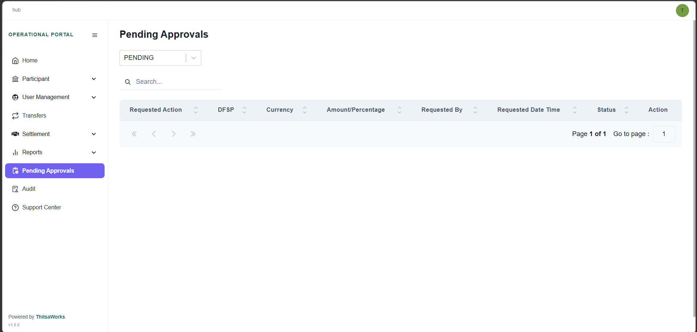
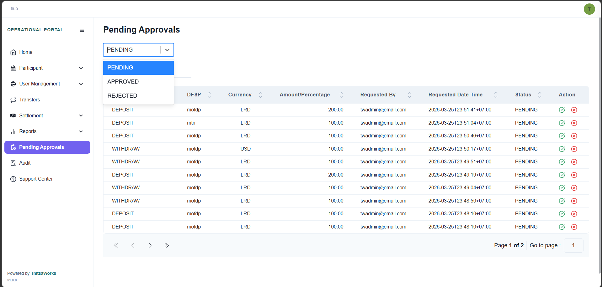
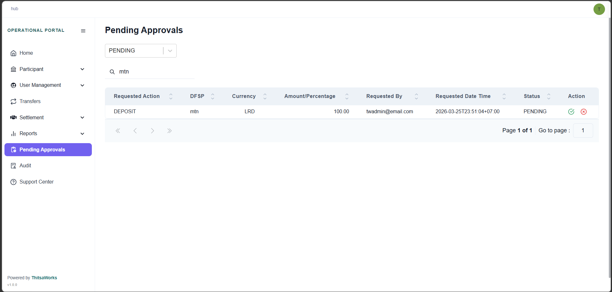

# Menu
## Pending Approvals

Do you remember that initiating deposits, processing withdrawals, and configuring the NDC are needed to approve. Here are the pending list which you did it in paticipant. You can choose to approve or reject. If you want to apporve, just click the green mark, and if you want to reject, click the red cross mark.

You can easily filter the list to display only PENDING, APPROVED and REJECTED.

To locate a specific request, you can use the search bar to query the system using any field listed in the columns. For instance, you can search directly by a DFSP name to find their record instantly.

