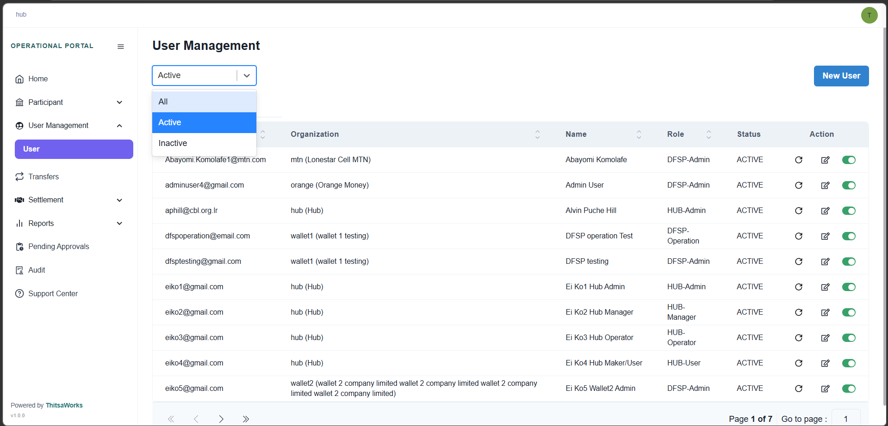
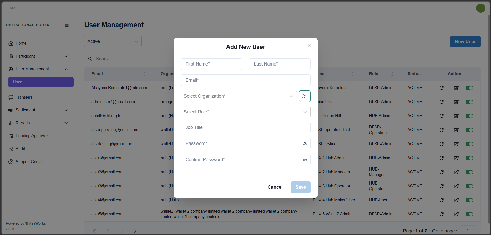
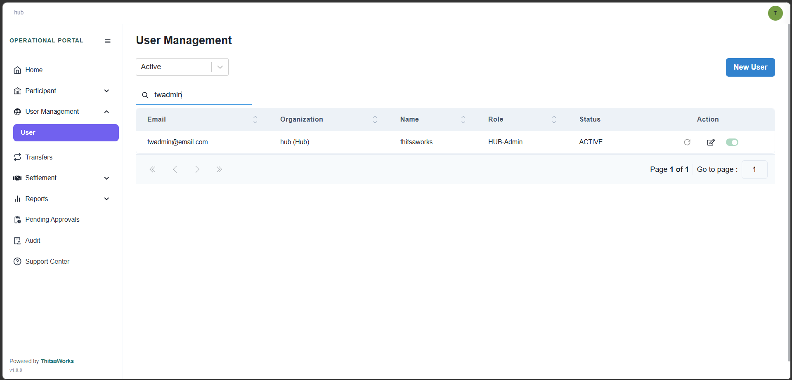
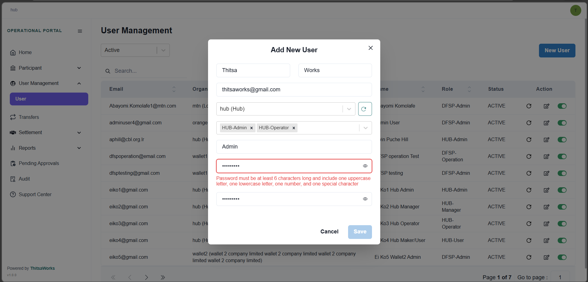

# Menu
## User

Within the user management view, you can easily filter the list to display only active or inactive accounts.

Please note that creating a new user is a restricted action. You must be logged in with either Admin-level or Manager-level credentials to access the user creation tool.

To locate a specific user, you can use the search bar to query the system using any field listed in the columns. For instance, you can search directly by a user's email address to find their record instantly.

When setting up a new user, please keep the following rules in mind:

- Mandatory Fields: Every field in the form is required, with the sole exception of the Job Title.
- Role Assignment: The available roles in the dropdown menu will vary based on the specific organization selected. Furthermore, users can be assigned multiple roles if necessary.
- Password Security: To ensure system security, passwords must be at least 6 characters long and contain at least one uppercase letter, one lowercase letter, one number, and one special character.

