# Menu
## Report

The Reports section provides eight different reports, each serving a specific purpose for different audiences — Hub Operators, DFSPs, auditors, and management teams.
Here's a quick look at all eight:

- Settlement Bank Report
- Settlement Detail Report
- Settlement Summary Report
- Settlement Statement Report
- Settlement Audit Report
- Audit Report
- Transaction Detail Report
- Management Summary Report

We'll go through each one in turn.

### Settlement Bank Report
This report is generated for the Settlement Bank — the financial institution responsible for confirming that participant DFSPs have fulfilled their settlement obligations.
What does it show?
It provides an aggregated view of all participating DFSPs and their respective multilateral net settlement positions for a given settlement.
In plain terms — it shows how much each DFSP owes or is owed at the point when a settlement is initiated.
When is it used?
The Settlement Bank uses this report to:

Validate settlement obligations across all participants
Facilitate the actual fund movements between DFSPs
Confirm that settlement has been completed across all participants

Think of this as the official financial instruction sheet sent to the bank at settlement time.

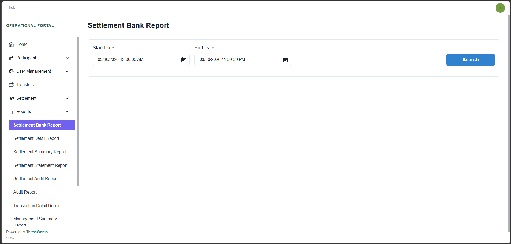
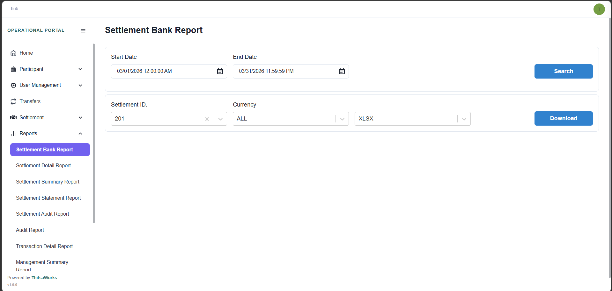

### Settlement Detail Report
This report is generated for a specific DFSP when a settlement is initiated.
What does it show?
Unlike the Settlement Bank Report — which gives an aggregated view — this report goes into full transaction-level detail. It lists every individual transfer that contributes to the DFSP's settlement position.
For each transfer, it includes:

- The transfer amount
- Whether the transfer was sent or received
- The currency
- The associated settlement window information

When is it used?
This report supports reconciliation and auditing. It allows the DFSP to trace exactly how their net settlement position was calculated — transfer by transfer.
If a DFSP ever questions their settlement amount, this is the report that shows them the working.

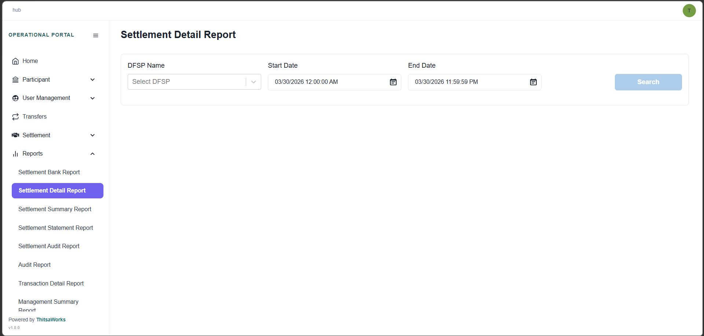
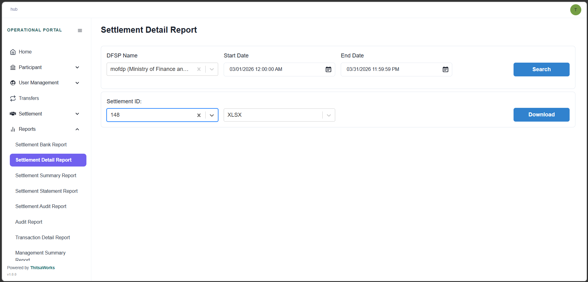

### Settlement Summary Report
Also generated for a specific DFSP at the time of settlement.
What does it show?
Where the Settlement Detail Report gives you the full breakdown, this report gives you the bottom line — the DFSP's Multilateral Net Settlement Position. This is the net total of all transfers sent and received across the settlement window or windows included in the settlement.
When is it used?
The DFSP uses this report to understand its net obligation or net receivable for the settlement — in other words, are they paying out or receiving funds, and how much?
If the Settlement Detail Report is the full receipt, the Settlement Summary Report is the final total.

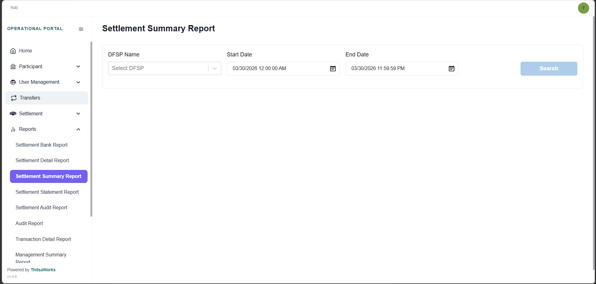
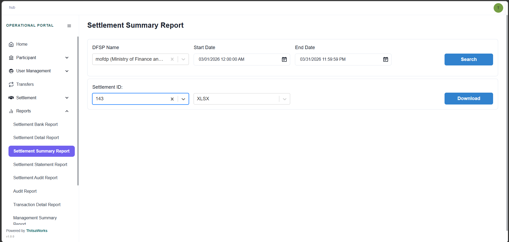

### Settlement Statement Report
This report is primarily used by DFSPs for their own internal financial management.
What does it show?
It provides a chronological statement of all financial-related movements for a DFSP over a selected period. This includes:

Settlement finalization events
Net Debit Cap updates
Funds movements — both deposits and withdrawals

Think of it like a bank statement for the DFSP's activity on the Hub — a running record of how each event affected their balance over time.
When is it used?
DFSPs use this report for:

- Financial reconciliation — matching Hub records to their own accounts
- Balance tracking — understanding how their liquidity balance changed over time
- Accounting purposes — particularly after fund movements or after settlements are finalized

This is the report to reach for when a DFSP needs to explain or verify how their balance got to where it is today.

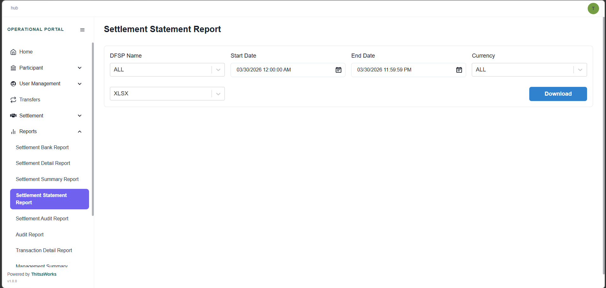

### Settlement Audit Report
This report is designed for Hub Operators, auditors, and compliance teams.
What does it show?
It provides a comprehensive, system-level audit trail of all financial and settlement-related events. The emphasis here is on traceability, accountability, and transparency.
When is it used?
Use this report to verify that financial movements were executed correctly, consistently, and in accordance with scheme guidelines and rules.
An important distinction: unlike the Settlement Statement Report — which focuses on financial reconciliation and balance impact — the Settlement Audit Report focuses on whether the right actions were taken, by the right processes, at the right times.
It's the report you turn to when you need to prove that settlement was conducted properly.

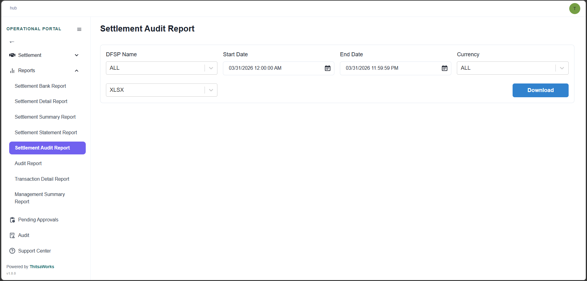

### Audit Report
This report supports auditability, traceability, security oversight, and compliance across the portal.
What does it show?
It provides a chronological record of system and user actions performed within the Operational Portal — capturing:

- Who performed an action
- What action was performed
- When it occurred

When is it used?
Whenever you need to investigate a specific user's activity, verify that a configuration change was made, or demonstrate to an auditor that the portal is being operated correctly.
While the Settlement Audit Report focuses specifically on financial and settlement events, the Audit Report covers all actions across the portal — including user management, configuration changes, approvals, and report generation.
If the Settlement Audit Report tells you what happened financially, the Audit Report tells you what everyone did in the system.

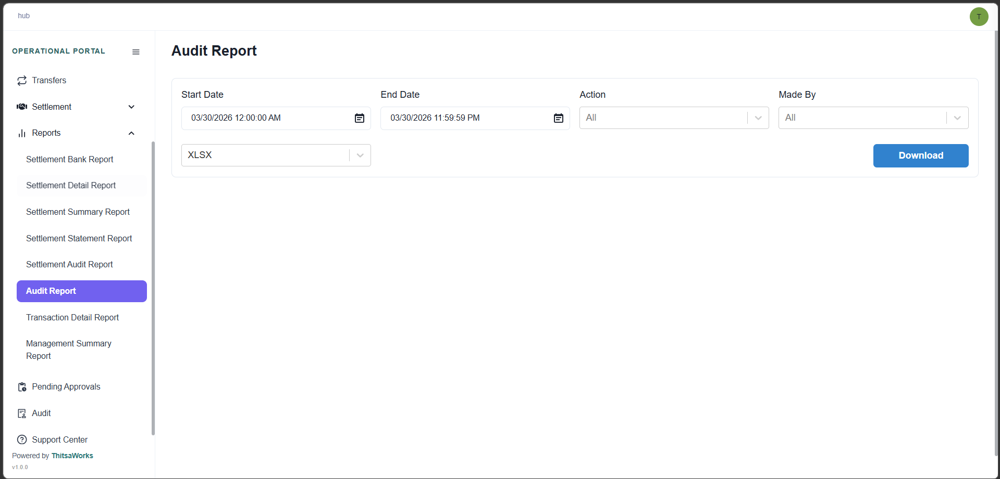

### Transaction Detail Report
This report is intended for operational monitoring, reconciliation, and detailed transaction analysis — used by Hub Operators and eligible DFSP roles.
What does it show?
It provides a comprehensive, transaction-level view of all transfers processed within a specified time period.
Each record in the report represents a single transfer and includes full contextual information such as:

-  Sender and receiver DFSPs
- Transfer type
- Monetary amounts
- Fees
- Currency
- Final transaction status

When is it used?
Use this report when you need to dig into the details of individual transactions — for example, during a reconciliation exercise, when investigating a dispute, or when analyzing transaction patterns across DFSPs.
This is the most detailed transfer-level report available in the portal.

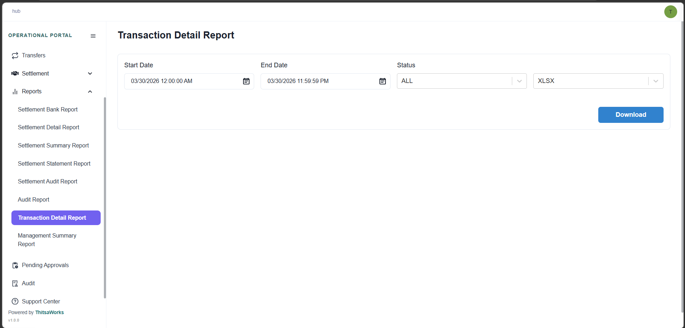

### Management Summary Report
This report is designed for management-level review and decision-making — giving leadership a high-level picture without needing to wade through individual transactions.
What does it show?
It provides a high-level, aggregated overview of transaction activity between DFSPs over a selected period.
Specifically, it aggregates:

- Transaction volumes between payer and payee DFSP pairs
- Total amounts between those pairs
- Grouped by currency

This gives management a concise view of transaction flows across the entire ecosystem.
When is it used?
When someone needs to answer questions like: "How much total transaction volume moved between DFSP A and DFSP B last month?" or "Which DFSP pairs are the most active?"
Unlike the Transaction Detail Report — which gives you every single transfer — this report gives you the summary totals, making it ideal for dashboards, management meetings, and strategic reviews.

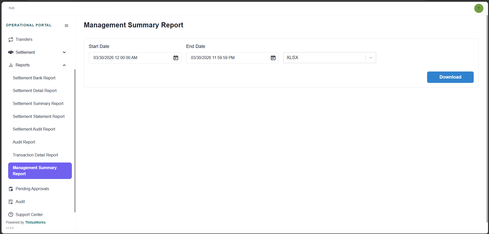