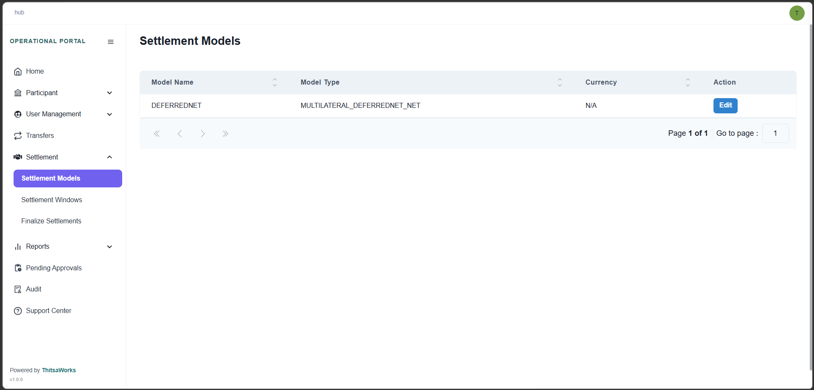
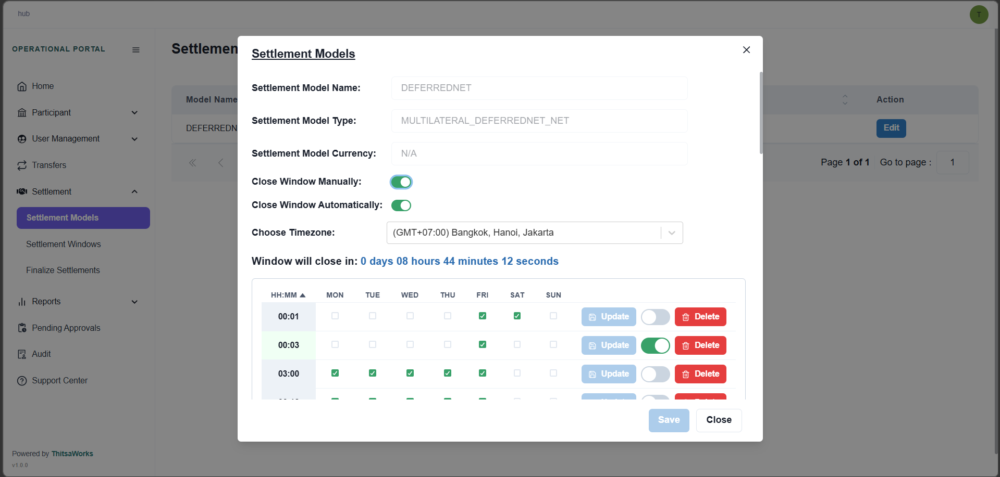
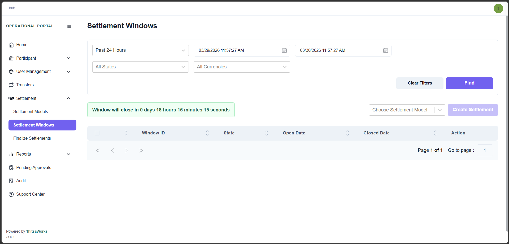
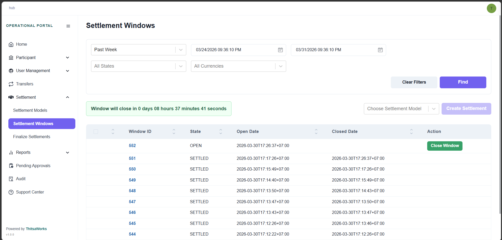
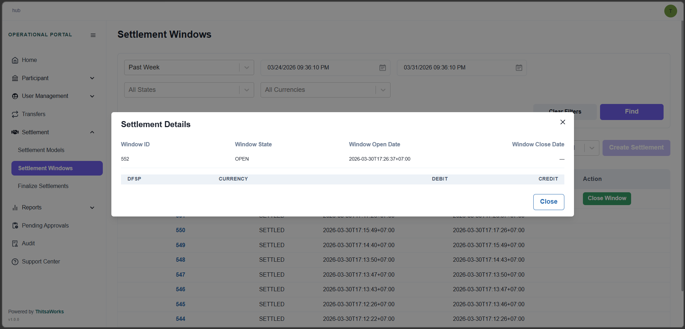
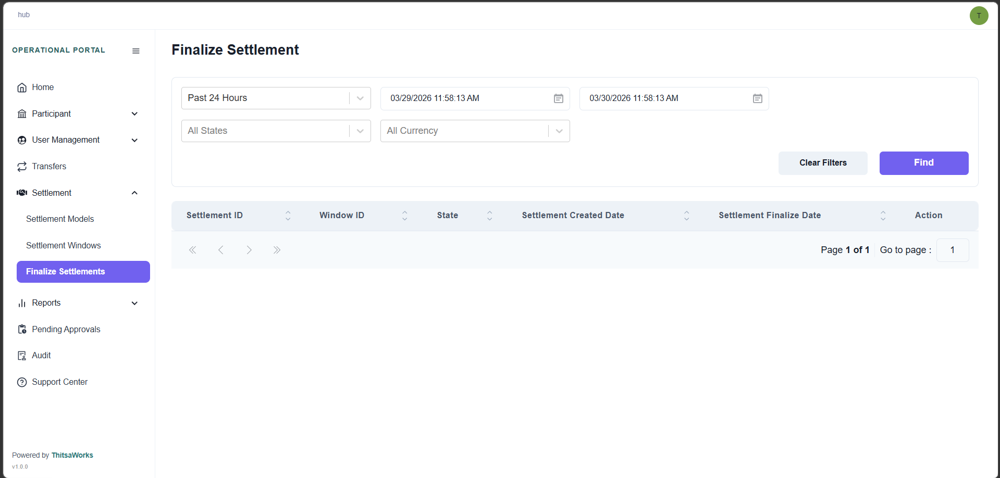
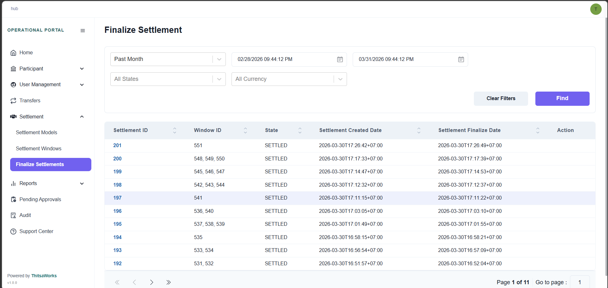
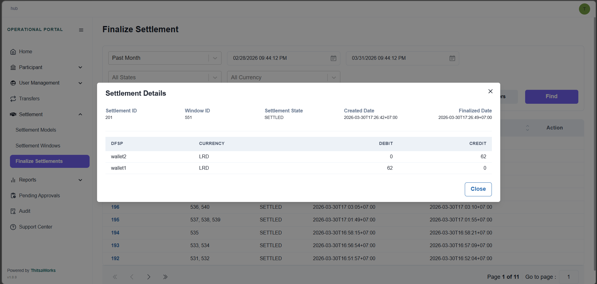

# Menu
## Settlement

In this module, we'll be covering the Settlement section of the portal. Settlement is one of the most critical functions in the Hub — it's how financial obligations between participants are finalized and confirmed.
By the end of this lesson, you'll understand how to configure settlement models, manage settlement windows, and finalize settlements.

The Settlement module gives Hub Operators the tools to:

Configure settlement behavior — deciding whether windows close manually, automatically, or both, using the Settlement Models menu.
Manage settlement cycles — through the Settlement Windows screen.
Review, validate, and complete settlements — using the Finalize Settlements screen.

There are three sub-sections we'll walk through in order: Settlement Models, Settlement Windows, and Finalize Settlements.

### Settlement Model
When you arrive at the Settlement Models screen, you'll see a list of configured models. Each entry shows:

- Model Name
- Model Type — for example, MULTILATERAL_DEFERREDNET_NET
- Currency
- An Edit action button

Click Edit on any model to open the configuration dialog. Here are the key fields you'll see:

- Settlement Model Name — this is read-only and cannot be changed.
- Settlement Model Type — also read-only.
- Settlement Model Currency — the currency this model applies to.
- Close Window Manually — a toggle. When enabled, operators can close windows by hand.
- Close Window Automatically — a toggle. When enabled, the system closes windows at the times you configure.
- Timezone — sets the timezone for all scheduled closing times. Note: after changing the timezone, you must click Save for it to take effect.

The Settlement Schedule Grid
Below the toggles, you'll find the Settlement Schedule Grid. This is where you define the specific times that automatic window closing will occur.
Each row in the grid includes:

- Time — in HH:MM format
- Days of the week — checkboxes to select which days this time applies
- An Enable/Disable toggle per row
- Update and Delete actions for each entry

A few important rules to keep in mind:

- Duplicate time entries are not allowed.
- At least one window closing method must be enabled — either Manual, Automatic, or both. You cannot have both turned off at the same time.
- The automatic closing times you configure here also drive the countdown timer displayed on the Settlement Windows screen, which we'll cover shortly.

### Settlement Window
A Settlement Window is a time-bound grouping of transfers. Think of it like a bucket — while a window is open, every completed transfer gets placed into that bucket. When the window closes, everything in the bucket is settled together as a single batch.
More specifically: any transfer that reaches the COMMITTED state during an open window is automatically assigned to that window. Once the window closes, all those committed transfers are grouped and processed together.
The Settlement Windows page allows you to:

Search for settlement windows using various filters
Close an open settlement window manually
Assign one or multiple windows for settling

One important note: Every completed transfer in the Hub is assigned to the currently open settlement window — regardless of which settlement model it belongs to. If a scheme has more than one settlement model, transfers from different models will still share the same window.

The Countdown Timer
You may notice a countdown timer on the Settlement Windows page. Here's how it works:

If the Deferred Net settlement model is configured and "Close Window Automatically" is turned ON — the countdown appears immediately when the page loads, counting down to the next scheduled closing time.
If "Close Window Automatically" is turned OFF — the countdown is hidden, and the following message is displayed instead:

"Countdown timer is not configured. Please contact the system administrator or check the configuration settings."

Filtering and Searching Settlement Windows
At the top of the page, you'll find the filter panel. You can filter by:

### Time Range
Choose from predefined options:

- Past 24 Hours
- Past 48 Hours
- Past Week
- Past Month
- Past Year

Or use a Custom Range by entering a start and end date.

### State
You can filter windows by their current state. Let's go through each state carefully, as understanding them is key to working with settlements.

- Open — The window is active and accepting transfers. All new completed transfers are being added to this window.
- Closed — The window is no longer accepting transfers. New transfers are being routed to a new, open window. This window is waiting to be settled.
- Processing — The system is in the process of clearing net positions. During this state, the net positions of payee DFSPs are cleared to zero. This is a safety measure to prevent incoming funds from the current window being used in future windows before settlement is complete.
- Pending — The window is closed, but settlement has not yet been confirmed. A window can only move to Settled once the settlement bank confirms that all participating DFSPs have fulfilled their payment obligations.
- Settled — The settlement bank has confirmed that all affected DFSPs have settled their obligations. The Hub Operator has finalized the window.
- Aborted — The window was part of a settlement that was aborted. An aborted window can be added to a new settlement.

Currency
Filter windows by transaction currency.
Actions

Click Find Transfer to execute the search.
Click Clear Filter to reset all filters.

### The Settlement Window List
The results table displays the following columns for each window:

- Window ID — the unique identifier of the settlement window
- State — the current state of the window
- Opened Date — when the window was opened
- Closed Date — when the window was closed
- Action — a Close Window button, which appears only for Open windows

### Window Details
Clicking on a Window ID opens a detail dialog. Here you'll see:

- Window ID
- Window State
- Open and Close timestamps
- A breakdown of each DFSP's Debit and Credit net amounts, per currency, within that specific window

This gives you a clear picture of what each participant owes or is owed for that window.

### Finalize Settlement
The Finalize Settlements screen is where Hub Operators complete the settlement process. This is where you take one or more closed settlement windows and formally settle them — confirming that all financial obligations have been met.

Similar to the other screens, you can filter by:
Time Range
The same predefined options apply — Past 24 Hours through Past Year — plus a Custom Range.
State
Settlements go through a series of states as they progress. Let's walk through each one:

- Pending Settlement — A new settlement has been created from one or more windows. The multilateral net position for each participant has been calculated. This is the starting state.
- PS Transfers Recorded — The Hub has internally marked the affected transfers as RECEIVED_PREPARE.
- PS Transfers Reserved — The Hub has internally marked the affected transfers as RESERVED.
- PS Transfers Committed — The Hub has internally marked the affected transfers as COMMITTED.
- Settling — Settlement is actively in progress.
- Settled — Settlement has completed successfully.
- Aborted — The settlement could not be completed and needs to be rolled back.

Currency
Filter by transaction currency.
Actions

Click Find Transfer to search.
Click Clear Filter to reset.

The Settlement List
The results table shows the following for each settlement:

- Settlement ID — the unique identifier for the settlement
- Window ID(s) — the window or windows included in this settlement. A single settlement can cover multiple windows, and all associated Window IDs are displayed.
- State — the current state of the settlement process
- Settlement Created Date — when the settlement was created in the Hub
- Settlement Finalized Date — the date and time of the last action taken on the settlement (for example, when funds were reserved or committed)
- Action — a Finalize button, which is only available for settlements in Pending status

Clicking a Settlement ID opens the Settlement Details dialog, which displays:

- Settlement ID
- Window ID
- Settlement State
- Created and Finalized timestamps
- Each DFSP's Debit and Credit net amounts, per currency, for that settlement

