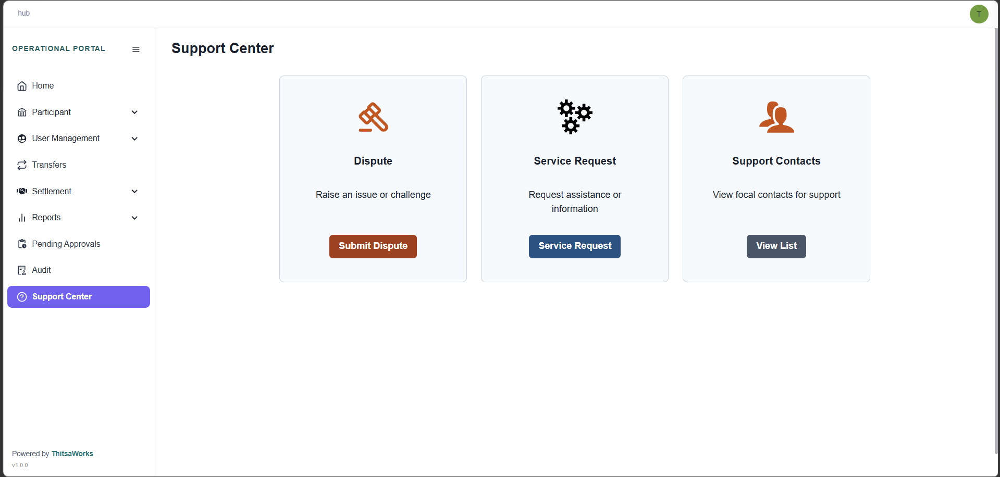

# Menu
## Support Center

When you click on Submit Dispute, the system will automatically direct you to Jira. From there, you can open an official ticket to log and track your dispute.

If you need general assistance or technical help, you can click on Service Request to file a support ticket.

Lastly, if you need to reach out to our team directly, you can find all the relevant communication channels under Support Contact.

