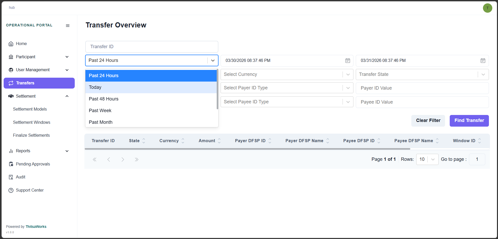
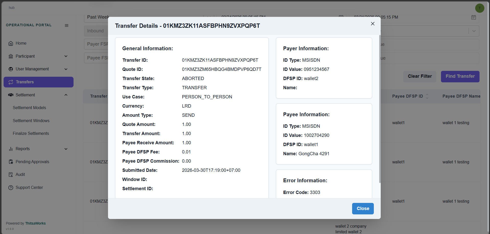

# Menu
## Transfer

The Transfer Overview page is your go-to screen for searching, viewing, and inspecting transfer transactions that have been processed through the Hub.
It gives you real-time visibility into the status of each transfer — and when a transfer has failed, it tells you exactly why.

Before we dive into the screen itself, let's quickly cover who can see what.
Hub users — that is, users from the central Hub organization — can view all transfers across every DFSP on the platform.
DFSP users, on the other hand, have a narrower view. They can only see transfers that involve their own DFSP — either as the Payer (sending money out) or as the Payee (receiving money in).
This access is automatically enforced by the system based on your role and organization. You don't need to configure anything — it just works.

At the top of the page, you'll see a filter panel. This is where you control what transfers appear in the results table below.
Let's go through each filter one by one.

### Transfer ID
If you already know the Transfer ID of the transaction you're looking for, enter it here. Once you do, it becomes the primary filter and overrides everything else. This is the fastest way to jump straight to a specific transfer.

### Time Range
If you don't have a Transfer ID, you can filter by time. You have several predefined options:

- Past 24 Hours
- Today
- Past 48 Hours
- Past Week
- Past Month
- Past Year

Or, you can select a Custom Range — just pick a start date and an end date.
Inbound / Outbound
This filter behaves differently depending on your role.

If you're a DFSP user, you can filter by whether transfers are inbound or outbound relative to your DFSP.
If you're a Hub user, this filter is disabled. Instead, you can select a specific DFSP from the Payer or Payee dropdown.

### Currency
Use this to filter transfers by their transaction currency.

### Transfer State
You can filter by the outcome of the transfer. There are two states:

- COMMITTED — the transfer was successful.
- ABORTED — the transfer failed.

Payer DFSP / Payee DFSP
Use the dropdown to filter by a specific DFSP — either as the payer or the payee. You can search by DFSP ID or name.
Payer ID Type / Payee ID Type
This filter lets you search by the type of identifier used to identify the payer or payee. Supported types include:

- ACCOUNT_ID
- ALIAS
- BUSINESS
- DEVICE
- EMAIL
- IBAN
- MSISDN
- PERSONAL_ID

Payer ID Value / Payee ID Value
Once you've selected an ID type, enter the actual identifier value here — for example, a phone number or email address.
Actions
Once your filters are set, click Find Transfer to run the search.
To reset everything back to default, click Clear Filter.

To get more information about any transfer, click on its Transfer ID in the table.
This opens the Transfer Details modal — a panel that gives you the full context of that transaction.

